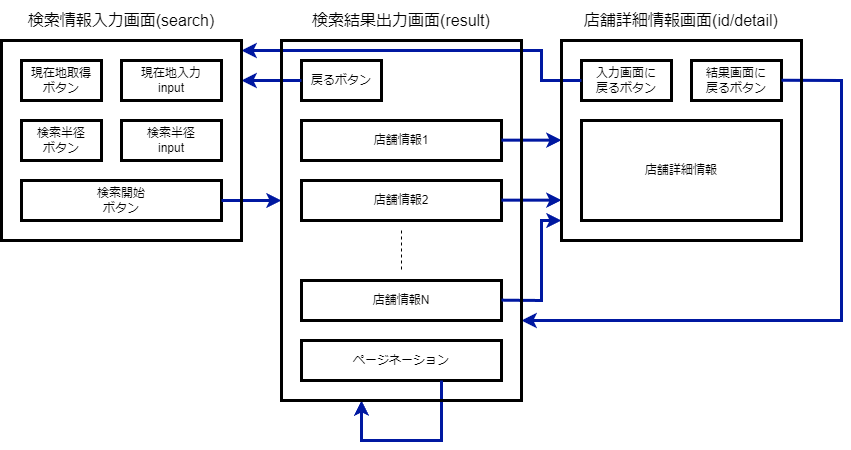

# 簡易仕様書
### 作者
小林陸駿
### アプリ名
ここ近飲食店
### 動作確認済みOS/ブラウザ
- windows
    - google chrome バージョン: 120.0.6099.225
    - Microsoft Edge for Business バージョン 120.0.2210.144 
### 開発環境
Visual Studio Code
### 開発言語
- PHP
- JavaScript
### 開発期間
2週間(平均実働時間:3[時間/日])
### 機能概要(機能一覧)
- 飲食店検索
- 飲食店情報取得
- 飲食店詳細リンク(ホットペッパーグルメの対応ページ表示)
### フレームワーク
- Laravel Framework 10.42.0
- bootstrap 5.3.0
### 設計書(入出力図)

### コンセプト
スマートフォンでも使用しやすい飲食店検索webアプリケーション
### こだわったポイント
付近の飲食店が見つからなかった際，現在地を取得できなかった際に表示されるエラーメッセージを実装した点．

取得した現在位置に応じたGoogle Mapのリンクを作成し，Geolocation APIによる計測位置の誤差を把握しやすいように設計した．
### デザイン面でこだわったポイント
Bootstrapを用いることで，余計な装飾を省き，シンプルかつ見やすい画面構成になることを心がけて作成した．

現在位置を取得して検索する使用上，スマートフォンでの利用が多くなると考え，レスポンシブ対応のデザインを実装した．
### アドバイスしてほしいポイント
デザインに関しては配色について，
コードに関してはコントローラーの処理についてご教授のほどよろしくお願いいたします
### 自己評価
Laravelの環境構築とgitとの連携の環境設定から始め，apiの使用，必要要件以上の内容を構成できた点は評価に値すると考える．

しかし，文言がbladeファイル内に直接記載されていることや検索結果にソート機能がないことは，運用/利用の観点から改善できる点であるため，今後の課題とする．

また，今後の展望としては，本課題において使用しなかったデータベース機能を追加し，ユーザー登録システム，お気に入りの店のブックマーク機能等の実装が挙げられる．
